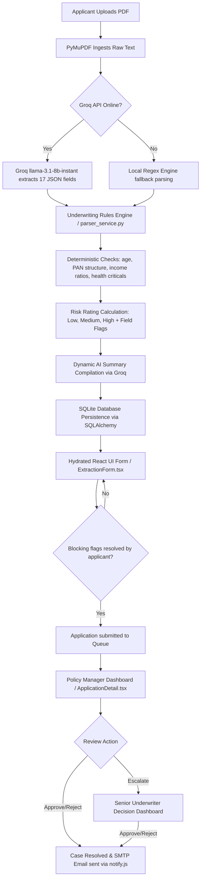

# InsureTrust: AI-Powered Life Insurance Intake & Underwriting Platform

**InsureTrust** is an automated life insurance application ingestion and rule-based underwriting evaluation platform. It leverages Large Language Models (LLMs) and standard rule checks to transform raw, unstructured PDF application forms into verified, structured data, highlighting potential health and financial risks for expedited decision-making.

---

## 🏗️ System Architecture & Data Flow

InsureTrust operates on a decoupled client-server architecture, moving applications from raw document files to finalized decisions.



---

## 🚀 Key Features

* **AI-Powered Data Ingestion:** Extracts raw text (using `PyMuPDF`) and outputs structured JSON keys representing applicant profiles (KYC, contact, health, occupation, income, coverage targets) using the `Groq API` (with `llama-3.1-8b-instant`).
* **Robust Fallback Engine:** Features a local regex-based parser to guarantee operations continue if Groq API keys are missing or reach rate limits.
* **Underwriting Validation & Rules Engine:**
  * **Identity Validation:** Verifies correct format constraints for Indian PAN card number (tax ID), phone numbers, and email addresses.
  * **Eligibility Limits:** Assesses age boundaries (must be between 18 and 65 years old) and policy term durations (5 to 30 years).
  * **Financial Underwriting:** Verifies standard coverage-to-income limits (flags high-risk applications where coverage exceeds 20x annual income or is > ₹5 Crores).
  * **Health & Lifestyle Risk Detection:** Flags high-risk habits (tobacco, excessive alcohol) and critical/chronic health issues (e.g., heart disease, cancer, diabetes, etc.).
* **Generative Underwriting Summary:** Automatically compiles candidate summaries and highlights risk flags into plain English underwriting notes using Groq.
* **Role-Based Workflows:**
  * **Applicants:** Upload application forms, review/correct extracted details, resolve validation issues, and submit.
  * **Policy Managers:** Review submitted applications on their dashboard, check flagged warnings, and choose to approve, reject, or escalate applications.
  * **Senior Managers:** Handle complex/escalated cases and high-value applications.

---

## 🛠️ Technology Stack

| Layer | Technology | Purpose |
| :--- | :--- | :--- |
| **Frontend** | React (TSX), Vite, TailwindCSS, Zustand | SPA client, routing, state management, document uploads & field verification forms |
| **Backend** | Python, FastAPI, Uvicorn | High-performance, async API endpoints, OAuth2 password-hash auth flow |
| **Database** | SQLite, SQLAlchemy ORM | Relational data persistence for Users (roles, passwords) and Applications |
| **AI/NLP Layer** | Groq API (`llama-3.1-8b-instant`), PyMuPDF | Structured text extraction, auto-generated plain text underwriting summaries |
| **Notifications** | Node.js / Nodemailer script (`notify.js`) | SMTP mail server notification system integration |

---

## 📂 Codebase Structure & Deep-dive Walkthrough

### 1. The Parsing & Validation Service ([parser_service.py](file:///c:/Users/ankit/Desktop/InsureTrust/backend/app/services/parser_service.py))
The engine orchestrates parsing in three core phases:
* **Text Extraction:** Using PyMuPDF (`fitz`), text characters are read from the uploaded document binary.
* **Extraction Strategy:** `extract_fields_with_groq` attempts to parse the document using Llama 3.1. If an API exception or JSON error is caught, the system gracefully calls `extract_fields_with_regex` as a fallback.
* **Underwriting Evaluation:** `run_validation_rules` evaluates the parsed fields:
  * **PAN Number Validation:**
    ```python
    if pan_val and not re.fullmatch(r"[A-Z]{5}[0-9]{4}[A-Z]", pan_val):
        # Adds high-severity blocking flag to pan_number key
    ```
  * **Financial Leverage Limits:** Evaluates if requested coverage exceeds 20x annual income or is > ₹5 Crores.
  * **Risk Rating Matrix:** Dynamically computes a risk rating (`low`, `medium`, `high`) based on the presence and severity of warnings.

### 2. State Management & Flow Transition ([main.py](file:///c:/Users/ankit/Desktop/InsureTrust/backend/app/main.py))
InsureTrust enforces a clean state transition model. Applications transition between:
`draft` ──► `pending` ──► `escalated` ──► `approved` / `rejected`

* **Submission Gatekeeper (`/submit`):**
  Ensures that applications cannot be submitted with active "blocking" flags (e.g. invalid KYC, out of age limit).
* **Workflows Actions (`/action`):**
  Restricts policy manager and senior manager decision paths. Policy managers can approve, reject, or escalate pending cases. Senior managers can approve or reject escalated cases. A final approval or rejection triggers automated notifications to the applicant via SMTP.

---

## ⚙️ Quick Start & Local Setup

### 1. Backend Setup
1. Create a virtual environment and activate it:
   ```bash
   python -m venv venv
   .\venv\Scripts\activate
   ```
2. Install dependencies:
   ```bash
   pip install -r backend/requirements.txt
   ```
3. Set up the root environment config file (`.env`):
   ```env
   GROQ_API_KEY="your_groq_api_key"
   SMTP_HOST="smtp.example.com"
   SMTP_PORT=587
   SMTP_USER="user@example.com"
   SMTP_PASS="password"
   ```
4. Run the FastAPI development server:
   ```bash
   uvicorn backend.app.main:app --reload
   ```

### 2. Frontend Setup
1. Navigate to the frontend directory:
   ```bash
   cd frontend
   ```
2. Install node dependencies:
   ```bash
   npm install
   ```
3. Run the Vite development server:
   ```bash
   npm run dev
   ```

---

## 👤 Persona-Based Workflows

### 1. Applicant Workflow
* Log in as an `applicant` role.
* Upload an application document.
* Correct the highlighted field validation flags on the interactive `ExtractionForm.tsx` interface and submit.

### 2. Policy Manager Workflow
* Log in as a `policy_manager` role.
* View `pending` applications.
* Read the generated **AI Underwriting Summary** and the individual warning flags.
* Approve, reject (with reasoning), or escalate the case.

### 3. Senior Manager Workflow
* Log in as a `senior_manager` role.
* View the `escalated` applications queue.
* Inspect the policy manager's escalation reason and make a final decision (Approve or Reject).
